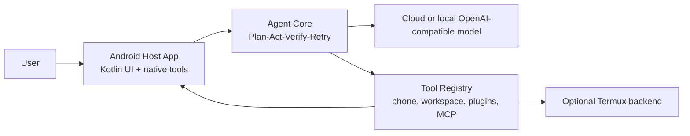

# Mobile Agent

[](LICENSE)

A phone-resident AI agent prototype. Mobile Agent runs the agent loop, tools, task traces, plugin workflow, and Android host bridge close to the phone instead of treating the phone as a passive ADB target.

The current project is experimental, but it is already more than a demo: it has a Kotlin Android Host App, a Python CLI/HTTP runtime, persistent sessions, Android screen/action tools, plugin reports, task workspaces, and a Plan-Act-Verify-Retry loop.


## Why This Exists

Most mobile automation agents start from a desktop process that drives a phone over ADB. That is useful for research, but it keeps the agent dependent on a computer. This project explores the opposite direction:

- the phone owns the runtime surface;
- AccessibilityService is the primary screen/action backend;
- Termux is an optional terminal/script backend;
- cloud models provide reasoning, while tools and traces stay local;
- task execution records evidence instead of trusting that a tool returning `ok=true` means the real-world goal is done.

## Highlights

- Native Android Host App with Chinese UI, local status page, tool detail views, and runtime event feed.
- OpenAI-compatible model support, including DeepSeek-style chat providers.
- Managed task loop with evidence, verification state, completion review, retry budget, and failure reports.
- Permission modes: `safe`, `ask`, `danger`, and `developer`.
- Android/phone tools for screen observation, actions, app state, Termux API, notifications, camera/sensor extension points, and host bridge calls.
- Workspace tools for reading, writing, searching, task artifacts, task reports, and plugin validation.
- Plugin workflow with `validate`, `test`, and `run` reports.
- Python test suite for the core loop, CLI, HTTP host, phone tools, plugins, Termux API, and host bridge.

## Architecture



## Quick Start

### 1. Clone and prepare Python

```sh
git clone https://github.com/tianhao789456/phone-native-agent.git
cd phone-native-agent
python -m venv .venv
```

On Windows PowerShell:

```powershell
.\.venv\Scripts\Activate.ps1
python -m pip install -U pip
python -m pip install -e ".[dev]"
```

On macOS, Linux, or Termux:

```sh
. .venv/bin/activate
python -m pip install -U pip
python -m pip install -e ".[dev]"
```

### 2. Run the mock CLI

```sh
python -m mobile_agent.hosts.cli --mock
```

Useful CLI commands:

- `/status`
- `/tools`
- `/session`
- `/history`
- `/traces`
- `/context`
- `/compact`
- `/exit`

### 3. Configure a real model

Copy the example environment file and add your key:

```sh
cp .env.example .env
```

Example OpenAI-compatible provider:

```sh
DEEPSEEK_API_KEY=...
MOBILE_AGENT_PROVIDER=openai_compat
MOBILE_AGENT_MODEL=deepseek-v4-flash
MOBILE_AGENT_BASE_URL=https://api.deepseek.com
```

Then run:

```sh
python -m mobile_agent.hosts.cli
```

### 4. Run the HTTP host

```sh
python -m mobile_agent.hosts.http_server --mock --host 127.0.0.1 --port 8787
```

Test it:

```sh
curl -X POST http://127.0.0.1:8787/chat \
  -H "Content-Type: application/json" \
  -d '{"message":"what tools can you use?"}'
```

### 5. Build the Android Host App

Requirements:

- JDK 17
- Android SDK with API 35
- Android build tools available through `ANDROID_HOME` or Android Studio

```sh
cd android-host
./gradlew assembleDebug
```

On Windows:

```powershell
cd android-host
.\gradlew.bat assembleDebug
adb install -r .\app\build\outputs\apk\debug\app-debug.apk
```

Enable the app's AccessibilityService on the phone before using screen observation or action tools.

## Termux Notes

Install Python in Termux:

```sh
pkg update
pkg install python git
git clone https://github.com/tianhao789456/phone-native-agent.git
cd phone-native-agent
python -m mobile_agent.hosts.cli --mock
```

Run the Termux HTTP host:

```sh
sh scripts/run-termux.sh
```

The native Android App can also bridge to a Termux HTTP backend when configured, but the long-term direction is to keep critical phone-control capability native in the Android Host App.

## Development

Run Python tests:

```sh
python -m pytest
```

Run Android build:

```sh
cd android-host
./gradlew assembleDebug
```

Repository layout:

```text
android-host/          Kotlin Android Host App
mobile_agent/          Python agent core, hosts, tools, bridge clients
plugins/               Example plugin/workflow packages
config/                Default agent config
scripts/               Local and Termux helper scripts
tests/                 Python tests
docs/                  Architecture notes, progress notes, assets
```

## Project Status

This is a personal experimental project, released under the MIT License. There is no long-term maintenance promise.

If the project is useful to you:

- star it;
- open issues with reproducible details;
- send focused PRs;
- fork it freely and push it in your own direction.

## Safety

Mobile Agent can expose powerful local tools. Keep `safe` mode as the default. Use higher-permission modes only on your own device and only when you understand what the requested tool can do.

Do not put API keys, private chat logs, task traces, generated screenshots, or local Android build files into commits.

## Related Ideas

Mobile Agent is aligned with phone-native and GUI-agent research, but its engineering direction is different from ADB-only controllers: it tries to make the phone the agent runtime, not only the device being operated.
