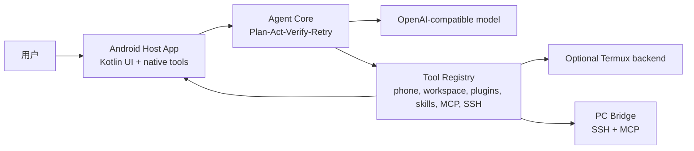

# Mobile Agent / 手机 Agent

[](LICENSE)
[](https://github.com/tianhao789456/phone-native-agent/releases/latest)

手机原生 AI Agent 原型。它把 Agent 循环、工具、任务轨迹、插件流程和 Android Host 桥接尽量放在手机侧，而不是把手机当成一个被动的 ADB 目标。

当前项目仍然是实验性原型，但已经不是空壳 demo：它包含 Kotlin Android Host App、Python CLI/HTTP 运行时、持久化会话、Android 屏幕/动作工具、任务工作区、插件报告，以及 `Plan / Act / Verify / Retry` 执行闭环。


## 中文说明

这个项目主要解决一件事：让手机自己承担自己的 Agent 执行面。

- 手机端是主运行面，Android Host App 负责界面、状态和工具入口。
- `AccessibilityService` 是主要的屏幕观察和动作后端。
- `Termux` 是可选的终端/脚本后端，不是强依赖。
- SSH 是手机连接电脑的稳定控制链路，可执行 PowerShell、传文件、修复 MCP 服务。
- MCP 可作为远程工具扩展，让手机 Agent 调用桌面能力。
- 任务执行不是“工具返回 ok 就算完成”，而是保留计划、证据、验证、重试和失败分析。

## 核心亮点

- 手机原生运行面：Android Host App 就是主界面、状态中心和工具入口。
- 中文优先：App UI、状态、日志和操作说明按中文日常使用设计。
- 证据驱动执行闭环：`Plan / Act / Verify / Retry`，带重试预算、失败报告和完成复核。
- 结构化手机 UI 观察：Accessibility 快照、元素索引、动作列表，减少盲点截图点击。
- 原生 Intent 工具：支持打开 URL、打开文件、分享文件等 Android 原生动作。
- 渐进式工具加载：工具、插件、Skill、MCP 都尽量先给摘要，需要时再展开详情。
- 记忆与经验接口：支持用户资料、经验、procedure、学习记录等手机侧长期上下文。
- SSH/PC Bridge：手机可通过 LAN 或 Tailscale 连接电脑，执行命令和 SFTP 文件传输。
- 多 MCP 预留：支持手机本地 MCP、桌面 MCP、Desktop Control MCP 等多服务配置。
- Termux 后端恢复：支持诊断、恢复、熔断和后台 HTTP 后端重启。

## 快速开始

```sh
git clone https://github.com/tianhao789456/phone-native-agent.git
cd phone-native-agent
python -m venv .venv
```

Windows PowerShell:

```powershell
.\.venv\Scripts\Activate.ps1
python -m pip install -U pip
python -m pip install -e ".[dev]"
python -m mobile_agent.hosts.cli --mock
```

macOS / Linux / Termux:

```sh
. .venv/bin/activate
python -m pip install -U pip
python -m pip install -e ".[dev]"
python -m mobile_agent.hosts.cli --mock
```

## 配置模型

复制环境变量模板并填入自己的 key：

```sh
cp .env.example .env
```

OpenAI-compatible provider 示例：

```sh
DEEPSEEK_API_KEY=...
MOBILE_AGENT_PROVIDER=openai_compat
MOBILE_AGENT_MODEL=deepseek-v4-flash
MOBILE_AGENT_BASE_URL=https://api.deepseek.com
```

然后运行：

```sh
python -m mobile_agent.hosts.cli
```

## Android Host App

构建要求：

- JDK 17
- Android SDK API 35
- Android build tools，可通过 Android Studio 或 `ANDROID_HOME` 提供

```sh
cd android-host
./gradlew assembleDebug
```

Windows:

```powershell
cd android-host
.\gradlew.bat assembleDebug
adb install -r .\app\build\outputs\apk\debug\app-debug.apk
```

使用屏幕观察和动作工具前，需要在手机系统设置里启用本 App 的无障碍服务。

## Termux 后端

Termux 是可选后端，用于手机本地脚本和终端能力。

```sh
pkg update
pkg install python git
git clone https://github.com/tianhao789456/phone-native-agent.git
cd phone-native-agent
sh scripts/start-http-termux.sh
```

如果需要让 Android Host App 自动拉起 Termux HTTP 后端，Termux 侧需要允许外部命令：

```sh
sh scripts/enable-termux-run-command.sh
```

## 电脑控制

手机 Agent 可以通过 SSH 连接电脑，完成：

- PowerShell / shell 命令执行；
- 手机文件推送到电脑；
- 电脑处理结果回传手机；
- 检查和恢复远程 MCP 服务；
- 通过 Tailscale 在外网环境访问自己的电脑。

详见 [SSH + PC 控制说明](docs/ssh-pc-control.md)。

## 架构



## 开发

运行 Python 测试：

```sh
python -m pytest
```

运行 Android 构建：

```sh
cd android-host
./gradlew assembleDebug
```

仓库结构：

```text
android-host/          Kotlin Android Host App
mobile_agent/          Python agent core, hosts, tools, bridge clients
plugins/               Example plugin/workflow packages
config/                Default agent config
scripts/               Local and Termux helper scripts
tests/                 Python tests
docs/                  Architecture notes, release notes, assets
```

## 当前状态

这是个人实验项目，MIT 协议开源，不承诺长期维护。

欢迎：

- star；
- 提交可复现 issue；
- 发送聚焦的小 PR；
- fork 后按自己的方向继续做。

## 安全说明

Mobile Agent 可以暴露很强的本地工具能力。默认应使用安全模式；只有在自己的设备上，并且理解工具风险时，再启用更高权限模式。

不要把 API key、私聊记录、任务轨迹、截图、Android 构建产物或本机运行时 token 提交进仓库。

## Release Assets

- [手机端截图](docs/assets/mobile-agent-home.png)
- [仓库预览图](docs/assets/github-social-preview.png)
- [v0.3.0-alpha Release Notes](docs/releases/v0.3.0-alpha.md)
- [v0.2.0-alpha Release Notes](docs/releases/v0.2.0-alpha.md)
