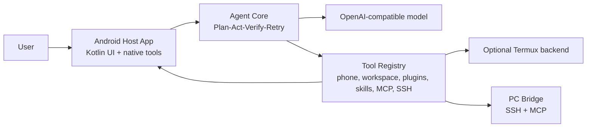

# Mobile Agent

[](LICENSE)
[](https://github.com/tianhao789456/phone-native-agent/releases/latest)

A phone-native AI Agent prototype. It keeps the agent loop, tools, task traces, plugin workflows, and Android Host bridge on the phone itself — rather than treating the phone as a passive ADB target.

This is still an experimental prototype, but it's no longer just a skeleton: it ships a Kotlin Android Host App, a Python CLI/HTTP runtime, persistent sessions, Android screen/action tools, task workspaces, plugin reports, and a **Plan / Act / Verify / Retry** execution loop.


## Overview

This project solves one core problem: **let the phone carry its own agent execution surface.**

- The phone is the primary runtime. The Android Host App owns the UI, state, and tool entry points.
- `AccessibilityService` is the main screen observation and action backend.
- `Termux` is an optional terminal/script backend, not a hard dependency.
- SSH is the stable control channel from phone to PC — run PowerShell, transfer files, repair MCP services.
- MCP extends remote tool capabilities, letting the phone agent call desktop resources.
- Task execution doesn't stop at "tool returned ok" — it retains plans, evidence, verification, retries, and failure analysis.

## Key Highlights

- **Phone-native runtime** – the Android Host App is the main UI, status center, and tool gateway.
- **Chinese-first UI** – app UI, status messages, logs, and instructions are designed for daily Chinese use.
- **Evidence-driven execution loop** – `Plan / Act / Verify / Retry` with retry budgets, failure reports, and completion review.
- **Structured phone UI observation** – Accessibility snapshots, element indices, action lists — reduces blind screenshot-clicking.
- **Native Intent tools** – open URLs, open files, share files, and other Android native actions.
- **Progressive tool loading** – tools, plugins, skills, and MCP are summarized first; details are expanded only when needed.
- **Memory and experience interface** – user profiles, experience, procedures, learning records, and other phone-side long-term context.
- **SSH/PC Bridge** – the phone connects to a PC over LAN or Tailscale to run commands and transfer files via SFTP.
- **Multi-MCP support** – phone-local MCP, desktop MCP, Desktop Control MCP, and more.
- **Termux backend recovery** – diagnostics, recovery, circuit-breaker, and HTTP backend restart.

## Quick Start

```sh
git clone https://github.com/tianhao789456/phone-native-agent.git
cd phone-native-agent
python -m venv .venv
```

**Windows PowerShell:**

```powershell
.\\.venv\Scripts\Activate.ps1
python -m pip install -U pip
python -m pip install -e ".[dev]"
python -m mobile_agent.hosts.cli --mock
```

**macOS / Linux / Termux:**

```sh
. .venv/bin/activate
python -m pip install -U pip
python -m pip install -e ".[dev]"
python -m mobile_agent.hosts.cli --mock
```

## Configure a Model

Copy the environment variable template and fill in your own key:

```sh
cp .env.example .env
```

Example with an OpenAI-compatible provider:

```sh
DEEPSEEK_API_KEY=...
MOBILE_AGENT_PROVIDER=openai_compat
MOBILE_AGENT_MODEL=deepseek-v4-flash
MOBILE_AGENT_BASE_URL=https://api.deepseek.com
```

Then run:

```sh
python -m mobile_agent.hosts.cli
```

## Android Host App

Build requirements:

- JDK 17
- Android SDK API 35
- Android build tools (provided by Android Studio or `ANDROID_HOME`)

```sh
cd android-host
./gradlew assembleDebug
```

Windows:

```powershell
cd android-host
.\gradlew.bat assembleDebug
adb install -r .\app\build\outputs\apk\debug\app-debug.apk
```

Before using screen observation and action tools, enable the app's Accessibility Service in your phone's system settings.

## Minimal Personal Assistant Loop

The current self-use target is intentionally narrow:

1. **Ask and research** – use `web_search`, `web_extract`, `http_get`, and `http_post` for public web lookup, page reading, and user-requested API calls. Results include source URL/content fields and structured failure categories so the task loop can recover instead of crashing.
2. **Find and share files** – use `find_files`, `search_files`, `read_file`, then `share_text`, `share_file`, `share_files`, or `open_file_with`. File sharing uses Android `ACTION_SEND` / `ACTION_SEND_MULTIPLE` and FileProvider content URI grants, not fragile WeChat UI clicking.
3. **Watch important notifications** – enable the notification listener in Android settings, then use `notification_status`, `notification_recent`, `notification_rules_get`, `notification_rules_set`, `notification_mark_important`, and `notification_summarize_candidates`. Notification text is hidden by default in recent-list output; request `include_text=true` only when the user explicitly wants to inspect contents.

## Stable PC Connection Mode

The Android app treats the computer as one logical target, `my_pc`. The transport behind that target is selected by profile priority:

1. `home_lan` – same-Wi-Fi LAN SSH, preferred for commands and large files.
2. `tailscale` or `wireguard` – VPN fallback when the phone is away from home.
3. `vps_reverse` – last-resort reverse tunnel for rescue commands and short diagnostics.

Use `connection_profiles` to view or update local-only profile settings (`name`, `type`, `host`, `port`, `user`, `enabled`, `priority`). Use `connection_select`, `connection_status`, `connection_diagnose`, and `connection_reconnect` before PC work. The selector returns `selected_profile`, `attempted_profiles`, `failure_category`, and `next_recommended_action` so the agent can stop blind retrying.

`file_push`, `file_pull`, and `pc_file_workflow` now run the selector first by default. Large files are steered toward `home_lan`; when a large transfer would use Tailscale or VPS fallback, the tool returns a policy warning because speed is limited by the home upload link or the relay path.

Keep real VPS hosts, private IPs, usernames, keys, and tokens in local app configuration only. Do not commit them to the public repository. For reliable background reconnects, allow the VPN app and Mobile Agent to run in the background, disable aggressive battery restrictions, and keep the PC SSH service enabled.

## Termux Backend

Termux is an optional backend for on-device scripting and terminal capabilities.

```sh
pkg update
pkg install python git
git clone https://github.com/tianhao789456/phone-native-agent.git
cd phone-native-agent
sh scripts/start-http-termux.sh
```

To let the Android Host App automatically start the Termux HTTP backend, Termux needs to allow external commands:

```sh
sh scripts/enable-termux-run-command.sh
```

## PC Control

The phone agent can connect to a PC over SSH to:

- Execute PowerShell / shell commands
- Push files from phone to PC
- Pull processed results back from PC to phone
- Inspect and restore remote MCP services
- Access your PC remotely via Tailscale when away from home

See [SSH + PC Control Guide](docs/ssh-pc-control.md).

## Architecture



## Development

Run Python tests:

```sh
python -m pytest
```

Build the Android app:

```sh
cd android-host
./gradlew assembleDebug
```

Repository layout:

```text
android-host/          Kotlin Android Host App
mobile_agent/          Python agent core, hosts, tools, bridge clients
plugins/               Example plugin/workflow packages
config/                Default agent config
scripts/               Local and Termux helper scripts
tests/                 Python tests
docs/                  Architecture notes, release notes, assets
```

## Current Status

This is a personal experimental project, open-sourced under the MIT license with no promise of long-term maintenance.

Contributions welcome:

- ⭐ Star the repo
- File reproducible issues
- Send focused small PRs
- Fork it and take it in your own direction

## Security

Mobile Agent can expose powerful local tool capabilities. Use safe mode by default; only enable higher permission levels on your own devices when you understand the risks.

Do not commit API keys, private chat logs, task traces, screenshots, Android build artifacts, or local runtime tokens into the repository.

## Release Assets

- [Phone screenshot](docs/assets/mobile-agent-home.png)
- [Repository preview image](docs/assets/github-social-preview.png)
- [v0.3.0-alpha Release Notes](docs/releases/v0.3.0-alpha.md)
- [v0.2.0-alpha Release Notes](docs/releases/v0.2.0-alpha.md)
