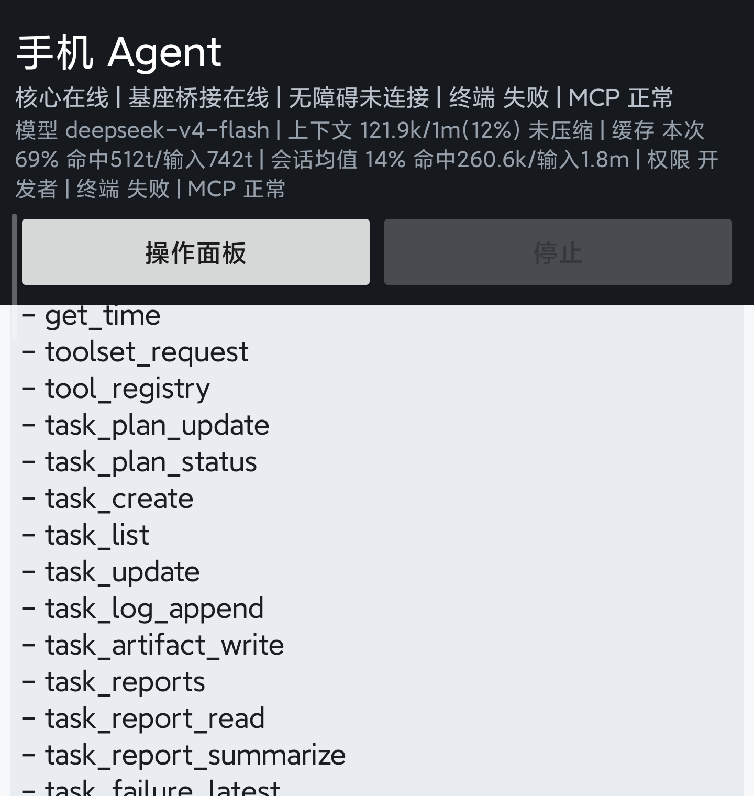
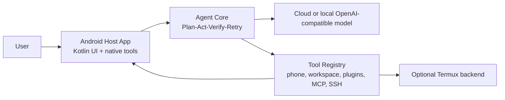

# Mobile Agent / 手机 Agent

[](LICENSE)
[](https://github.com/tianhao789456/phone-native-agent/releases/latest)

手机原生 AI Agent 原型。它把 agent 循环、工具、任务轨迹、插件流程和 Android Host 桥接尽量放在手机侧，而不是把手机当成一个被动的 ADB 目标。

当前项目仍然是实验性原型，但已经不是空壳 demo：它有 Kotlin Android Host App、Python CLI/HTTP 运行时、持久化会话、Android 屏幕/动作工具、插件报告、任务工作区，以及 `Plan / Act / Verify / Retry` 闭环。

This repository is written for Chinese-first day-to-day use. The Android UI, runtime logs, and most operational notes are in Chinese, with English kept where it helps outside readers or upstream publishing.



Release assets and the repository preview image are available from the latest release:

- [v0.1.0 release](https://github.com/tianhao789456/phone-native-agent/releases/tag/v0.1.0)
- [Social preview asset](docs/assets/github-social-preview.png)

## 中文说明

这个项目主要解决一件事：让手机自己承担自己的 Agent 执行面，而不是总依赖电脑去控制手机。

- 手机端是主运行面，Android Host App 负责界面、状态和工具接入。
- `AccessibilityService` 是主要的屏幕/动作后端。
- `Termux` 是可选的终端/脚本后端，不是强依赖。
- 模型负责推理，工具和证据尽量保留在本地。
- 任务执行不是“工具返回 `ok=true` 就算完”，而是要有证据和验证状态。

## 中文快速开始

```sh
git clone https://github.com/tianhao789456/phone-native-agent.git
cd phone-native-agent
python -m venv .venv
```

Windows PowerShell：

```powershell
.\.venv\Scripts\Activate.ps1
python -m pip install -U pip
python -m pip install -e ".[dev]"
python -m mobile_agent.hosts.cli --mock
```

## Why This Exists

Most mobile automation agents start from a desktop process that drives a phone over ADB. That is useful for research, but it keeps the agent dependent on a computer. This project explores the opposite direction:

- the phone owns the runtime surface;
- AccessibilityService is the primary screen/action backend;
- Termux is an optional terminal/script backend;
- native SSH is the stable backend control bridge, with SFTP file transfer for phone <-> PC workflows;
- SSH is the preferred way to repair backend services, move files, and keep the computer controllable when GUI tools fail;
- cloud models provide reasoning, while tools and traces stay local;
- task execution records evidence instead of trusting that a tool returning `ok=true` means the real-world goal is done.

## 核心亮点

- 手机原生运行面：Android Host App 就是主界面、状态中心和工具入口，不是挂在电脑上的附属壳。
- 中文优先：App UI、运行日志和操作说明已经按中文日常使用来做，开箱就能看懂。
- 证据驱动闭环：`Plan / Act / Verify / Retry`，带完成复核、重试预算和失败报告，不是“工具回了 ok 就算完”。
- 无障碍优先的手机控制：覆盖观察、点击、滑动、应用状态、通知等手机侧动作。
- 可选 Termux 后端：终端和脚本执行是可插拔能力，不是强制把整套运行时都绑在终端上。
- 远程 MCP 桥接：手机可以检查并调用你配置好的 MCP 服务器，部署好 Windows MCP 或其他桌面 MCP 后，就能通过局域网或 Tailscale 接电脑工具。
- OpenAI 兼容模型接入：DeepSeek 这类兼容模型可以直接给本地工具做推理。
- 工作区和插件支持：文件工具、任务产物、报告，以及 `validate` / `test` / `run` 的插件流程。
- 内置稳定性修复：终端恢复、上下文裁剪、会话持久化，以及覆盖核心循环和工具面的 Python 测试。

## 素材

- [手机端截图](docs/assets/mobile-agent-home.png)
- [仓库预览图](docs/assets/github-social-preview.png)
- [手机主导连接电脑：SSH + 文件传输](docs/ssh-pc-control.md)
- [v0.2.0-alpha Release Notes](docs/releases/v0.2.0-alpha.md)
- [v0.1.0 Release](https://github.com/tianhao789456/phone-native-agent/releases/tag/v0.1.0)

## Architecture



## Quick Start

### 1. Clone and prepare Python

```sh
git clone https://github.com/tianhao789456/phone-native-agent.git
cd phone-native-agent
python -m venv .venv
```

On Windows PowerShell:

```powershell
.\.venv\Scripts\Activate.ps1
python -m pip install -U pip
python -m pip install -e ".[dev]"
```

On macOS, Linux, or Termux:

```sh
. .venv/bin/activate
python -m pip install -U pip
python -m pip install -e ".[dev]"
```

### 2. Run the mock CLI

```sh
python -m mobile_agent.hosts.cli --mock
```

Useful CLI commands:

- `/status`
- `/tools`
- `/session`
- `/history`
- `/traces`
- `/context`
- `/compact`
- `/exit`

### 3. Configure a real model

Copy the example environment file and add your key:

```sh
cp .env.example .env
```

Example OpenAI-compatible provider:

```sh
DEEPSEEK_API_KEY=...
MOBILE_AGENT_PROVIDER=openai_compat
MOBILE_AGENT_MODEL=deepseek-v4-flash
MOBILE_AGENT_BASE_URL=https://api.deepseek.com
```

Then run:

```sh
python -m mobile_agent.hosts.cli
```

### 4. Run the HTTP host

```sh
python -m mobile_agent.hosts.http_server --mock --host 127.0.0.1 --port 8787
```

Test it:

```sh
curl -X POST http://127.0.0.1:8787/chat \
  -H "Content-Type: application/json" \
  -d '{"message":"what tools can you use?"}'
```

### 5. Build the Android Host App

Requirements:

- JDK 17
- Android SDK with API 35
- Android build tools available through `ANDROID_HOME` or Android Studio

```sh
cd android-host
./gradlew assembleDebug
```

On Windows:

```powershell
cd android-host
.\gradlew.bat assembleDebug
adb install -r .\app\build\outputs\apk\debug\app-debug.apk
```

Enable the app's AccessibilityService on the phone before using screen observation or action tools.

## Termux Notes

Install Python in Termux:

```sh
pkg update
pkg install python git
git clone https://github.com/tianhao789456/phone-native-agent.git
cd phone-native-agent
python -m mobile_agent.hosts.cli --mock
```

Run the Termux HTTP host:

```sh
sh scripts/run-termux.sh
```

The native Android App can also bridge to a Termux HTTP backend when configured, but the long-term direction is to keep critical phone-control capability native in the Android Host App.

## Development

Run Python tests:

```sh
python -m pytest
```

Run Android build:

```sh
cd android-host
./gradlew assembleDebug
```

Repository layout:

```text
android-host/          Kotlin Android Host App
mobile_agent/          Python agent core, hosts, tools, bridge clients
plugins/               Example plugin/workflow packages
config/                Default agent config
scripts/               Local and Termux helper scripts
tests/                 Python tests
docs/                  Architecture notes, progress notes, assets
```

## Project Status

This is a personal experimental project, released under the MIT License. There is no long-term maintenance promise.

If the project is useful to you:

- star it;
- open issues with reproducible details;
- send focused PRs;
- fork it freely and push it in your own direction.

## Safety

Mobile Agent can expose powerful local tools. Keep `safe` mode as the default. Use higher-permission modes only on your own device and only when you understand what the requested tool can do.

Do not put API keys, private chat logs, task traces, generated screenshots, or local Android build files into commits.

## Related Ideas

Mobile Agent is aligned with phone-native and GUI-agent research, but its engineering direction is different from ADB-only controllers: it tries to make the phone the agent runtime, not only the device being operated.
